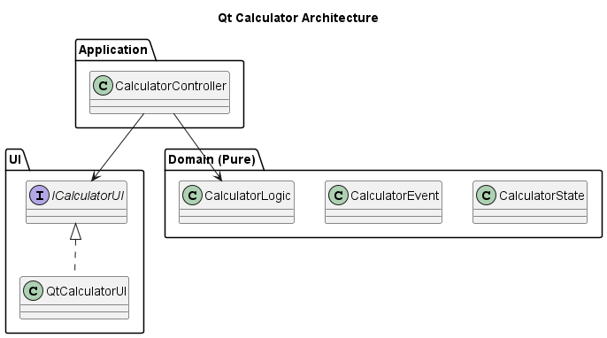
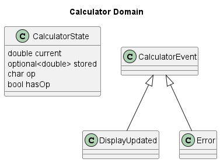
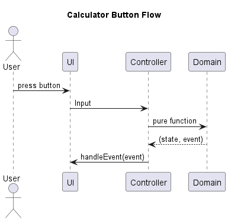

# Qt Calculator (C++ / Qt6)


---

## 📌 Overview

A calculator application built with **C++17 and Qt6**, designed using clean architecture principles and a pure-function domain model.

This project intentionally applies the same architectural philosophy as the accompanying Number Guess Game project, demonstrating architectural consistency across different domains.

---

## 🎯 Features

- Basic arithmetic operations: `+`, `-`, `*`, `/`
- Continuous calculation (e.g. `2 + 3 + 4 = 9`)
- Clear (`C`) button
- Event-driven Qt UI
- Immutable-style state transitions
- Domain logic completely decoupled from UI

---

## 🏗 Architecture

The project follows a layered architecture:
```bat
UI (Qt)
↓
Application (Controller)
↓
Domain (Pure Functions)
```

### Architecture UML



PlantUML source:  
`docs/uml/architecture.puml`

The Domain layer has zero dependency on Qt or any UI framework.

---

## 🧠 Domain Model (Pure Functional Core)

The domain consists of:

- `CalculatorState`
- `CalculatorEvent` (`std::variant`)
- Pure functions:
  - `inputDigit`
  - `inputOperator`
  - `calculate`
  - `clearAll`

### Domain UML



PlantUML source:  
`docs/uml/domain.puml`

### Design Principles

- No I/O inside domain
- No framework dependencies
- Deterministic state transitions
- Fully unit-testable

---

## 🔄 Sequence Flow

When a button is pressed:

1. UI emits `Input`
2. Controller invokes domain function
3. Domain returns `(newState, Event)`
4. UI updates display

### Sequence Diagram



PlantUML source:  
`docs/uml/sequence.puml`

---

## 📂 Project Structure
```bat
cpp-calculator/
├─ src/
│ ├─ app/ # Controller
│ ├─ domain/ # Pure logic
│ ├─ ui/ # Qt UI
│ └─ main.cpp
├─ docs/
│ └─ uml/
│ ├─ architecture.puml
│ ├─ domain.puml
│ └─ sequence.puml
└─ .github/workflows/
```

---

## ⚙️ Build (Windows + MSYS2)

### Requirements

- MSYS2 (UCRT64)
- mingw-w64-ucrt-x86_64-gcc
- mingw-w64-ucrt-x86_64-cmake
- mingw-w64-ucrt-x86_64-qt6

### Build Steps

```bash
mkdir build
cd build
cmake -S .. -B .
cmake --build .
```

### Run

```bash
./src/QtCalculator.exe
```

## 🚀 CI & Release

This project uses GitHub Actions:
- Windows runner
- MSYS2 toolchain
- Qt6 integration
- Automatic artifact upload
- Release on tag push

Release example:
```bash
git tag v1.0.0
git push origin v1.0.0
```

The executable will automatically be attached to the GitHub Release.

## 📊 Architectural Consistency

This calculator shares the same architectural philosophy as the Number Guess Game project:
```bat
| Aspect           | Calculator | Number Guess Game |
| ---------------- | ---------- | ----------------- |
| Pure Domain      | ✅          | ✅                 |
| Variant Events   | ✅          | ✅                 |
| Clean Separation | ✅          | ✅                 |
| CI/CD            | ✅          | ✅                 |
```

## 🧪 Testability

Because the domain is pure:
- No mocking required
- Deterministic behavior
- High unit-test coverage possible
- UI and domain can evolve independently

## 🧩 Design Evolution

1. Basic OOP structure
2. Event-driven model using std::variant
3. Pure-function domain refactor
4. Qt UI fully decoupled

The final design emphasizes:
- Clear responsibility boundaries
- Minimal coupling
- Explicit state modeling
- Maintainability

## 🤖 Development Note

This project was developed with the assistance of AI tools for architectural exploration and debugging support.
All integration, configuration, debugging, and validation were performed by the author.

## 📜 License

MIT License